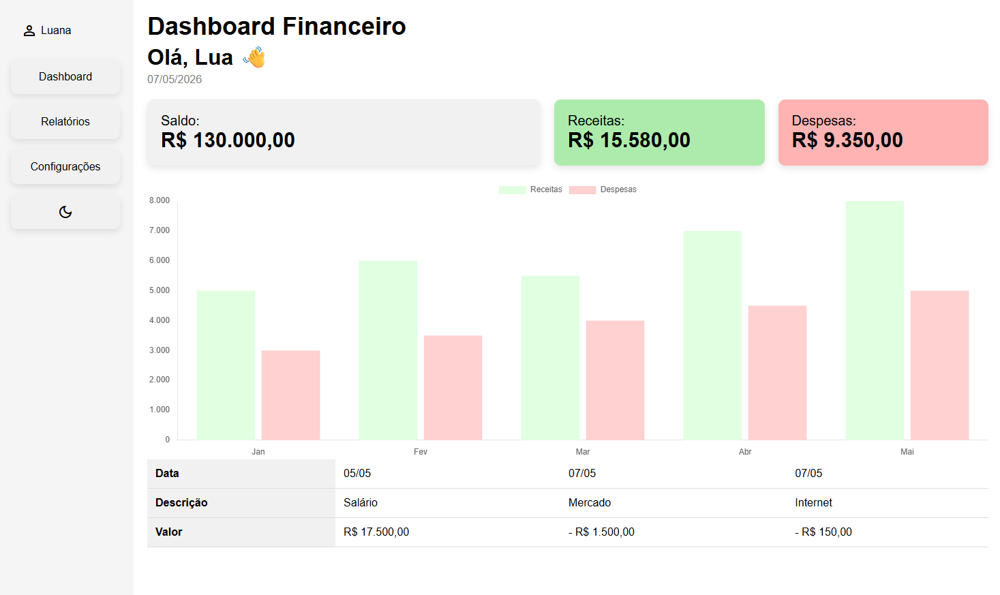

# 📊 Fake Financial Dashboard

Projeto de dashboard financeiro fictício desenvolvido para praticar conceitos de front-end com HTML, CSS e JavaScript puro.

## 🚀 Funcionalidades

- Tela de login fake com validação de formulário
- Dashboard financeiro
- Cards com indicadores financeiros
- Gráfico de receitas e despesas com Chart.js
- Dark mode
- Layout responsivo
- Menu lateral adaptável para mobile
- Tabela de movimentações financeiras

## 🛠️ Tecnologias utilizadas

- HTML5
- CSS3
- JavaScript
- Chart.js

## 📱 Responsividade

O projeto foi desenvolvido com foco em responsividade, adaptando o layout para tablets e dispositivos móveis.

## 🎯 Objetivo do projeto

Este projeto foi criado com o objetivo de praticar:

- Estruturação de layouts
- Responsividade
- Manipulação de DOM
- Eventos em JavaScript
- Organização de arquivos
- Experiência do usuário (UX)

## 🔗 Acesse o projeto

👉 https://luanalsmartins.github.io/fake-dashboard/

## 📸 Preview

## 👩‍💻 Autora

Feito por Luana Martins
